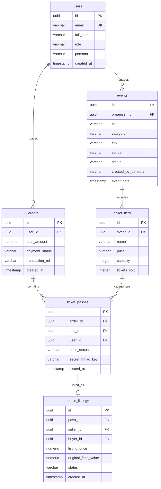

# SnapTix Database Design & Choice Justification

> **⚠️ Document describes the target state, not the running system.**
>
> As implemented, SnapTix runs on **MySQL 8** (`127.0.0.1:3310`, see `application.yml`) with no Redis and no read replicas. Two consequences worth knowing before using this document as a reference:
>
> - The `chk_capacity CHECK (tickets_sold <= capacity)` constraint documented in §3 was never created by Flyway `V1`. It is scheduled for `V3`.
> - `spring.jpa.hibernate.ddl-auto` is set to `update`, so Hibernate mutates the schema alongside Flyway. Migrations are therefore not currently the source of truth. Tracked as defect **D8**.
>
> Tables added for inventory holds, event signing keys, and scan audit are specified in `CONCURRENCY_AND_OFFLINE_SCANNING.md` §4.

## 1. Database Choice & Rationale

**Chosen Database:** **PostgreSQL 16** (with Redis 7 as In-Memory Cache)

### Justification:
1. **ACID Compliance & Financial Consistency:** Ticket inventory during high-demand flash drops requires strict transactional guarantees (`SERIALIZABLE` or `READ COMMITTED` with pessimistic row locking). PostgreSQL guarantees zero double-booking under concurrency.
2. **JSONB Support:** Event metadata, custom questionnaire fields, and venue seat maps can be stored flexibly using native JSONB indexing without schema migrations.
3. **PostGIS Extensions:** Supports ultra-fast geospatial queries (`ST_DWithin`) for distance radius filtering ("Find events within 15 miles of New York, NY").
4. **Rich Indexing:** B-Tree, GIN (for JSONB and full-text search), and GiST indexes for instant response times.

---

## 2. Entity Relationship (ER) Diagram



---

## 3. SQL Relational Schema DDL

```sql
-- Users Table
CREATE TABLE users (
    id UUID PRIMARY KEY DEFAULT gen_random_uuid(),
    email VARCHAR(255) UNIQUE NOT NULL,
    password_hash VARCHAR(255) NOT NULL,
    full_name VARCHAR(100) NOT NULL,
    role VARCHAR(30) NOT NULL DEFAULT 'ATTENDEE',
    persona VARCHAR(30) NOT NULL DEFAULT 'admin',
    created_at TIMESTAMP WITH TIME ZONE DEFAULT CURRENT_TIMESTAMP
);

-- Events Table
CREATE TABLE events (
    id UUID PRIMARY KEY DEFAULT gen_random_uuid(),
    organizer_id UUID REFERENCES users(id),
    title VARCHAR(255) NOT NULL,
    description TEXT,
    category VARCHAR(50) NOT NULL,
    city VARCHAR(100) NOT NULL,
    venue VARCHAR(255) NOT NULL,
    image_url TEXT,
    status VARCHAR(30) NOT NULL DEFAULT 'draft',
    created_by_persona VARCHAR(30) NOT NULL DEFAULT 'admin',
    event_date TIMESTAMP WITH TIME ZONE NOT NULL,
    created_at TIMESTAMP WITH TIME ZONE DEFAULT CURRENT_TIMESTAMP
);

-- Ticket Tiers Table
CREATE TABLE ticket_tiers (
    id UUID PRIMARY KEY DEFAULT gen_random_uuid(),
    event_id UUID REFERENCES events(id) ON DELETE CASCADE,
    name VARCHAR(100) NOT NULL,
    price NUMERIC(10, 2) NOT NULL DEFAULT 0.00,
    capacity INTEGER NOT NULL DEFAULT 100,
    tickets_sold INTEGER NOT NULL DEFAULT 0,
    CONSTRAINT chk_capacity CHECK (tickets_sold <= capacity)
);

-- Orders Table
CREATE TABLE orders (
    id UUID PRIMARY KEY DEFAULT gen_random_uuid(),
    user_id UUID REFERENCES users(id),
    total_amount NUMERIC(10, 2) NOT NULL,
    payment_status VARCHAR(30) NOT NULL DEFAULT 'PENDING',
    transaction_ref VARCHAR(100) UNIQUE,
    created_at TIMESTAMP WITH TIME ZONE DEFAULT CURRENT_TIMESTAMP
);

-- Ticket Passes Table (Dynamic Anti-Scalping Pass)
CREATE TABLE ticket_passes (
    id UUID PRIMARY KEY DEFAULT gen_random_uuid(),
    order_id UUID REFERENCES orders(id),
    tier_id UUID REFERENCES ticket_tiers(id),
    user_id UUID REFERENCES users(id),
    pass_status VARCHAR(30) NOT NULL DEFAULT 'ACTIVE',
    secret_hmac_key VARCHAR(255) NOT NULL,
    issued_at TIMESTAMP WITH TIME ZONE DEFAULT CURRENT_TIMESTAMP
);

-- Indexes for High Performance
CREATE INDEX idx_events_status_category ON events(status, category);
CREATE INDEX idx_events_city ON events(city);
CREATE INDEX idx_ticket_passes_user ON ticket_passes(user_id, pass_status);
CREATE INDEX idx_orders_user ON orders(user_id);
```
