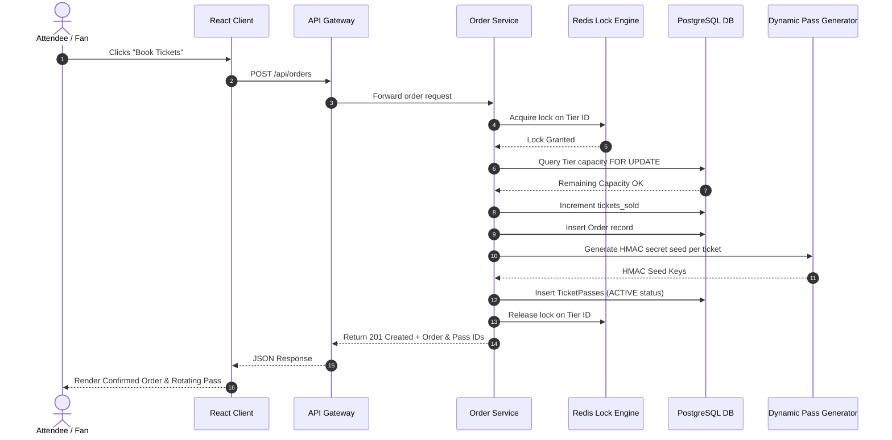
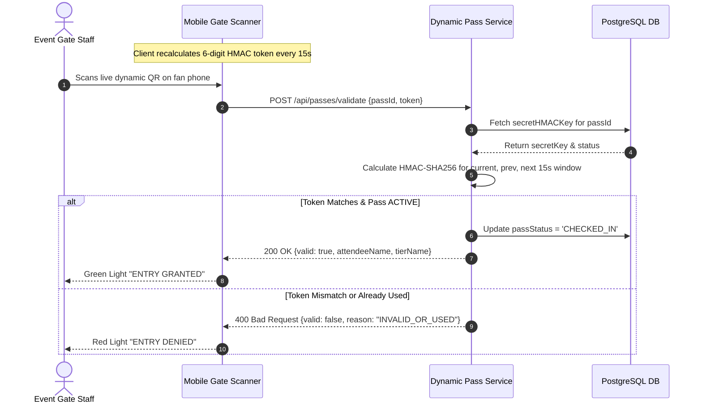
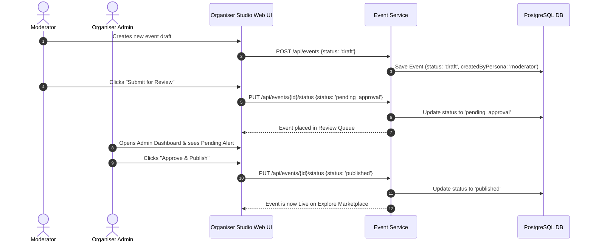

# SnapTix Data Sequence & Flow Diagrams

## 1. Ticket Purchase Flow (Anti-Scalping Escrow Order)

---

## 2. Gate QR Scanner Verification Sequence (0.2s Validation)

---

## 3. Moderator Event Approval Sequence (RBAC Workflow)

