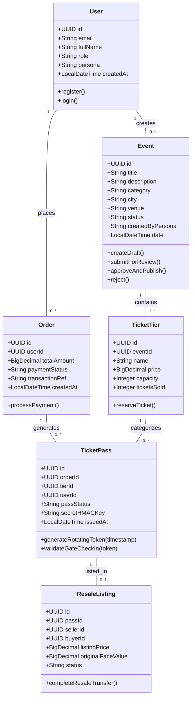
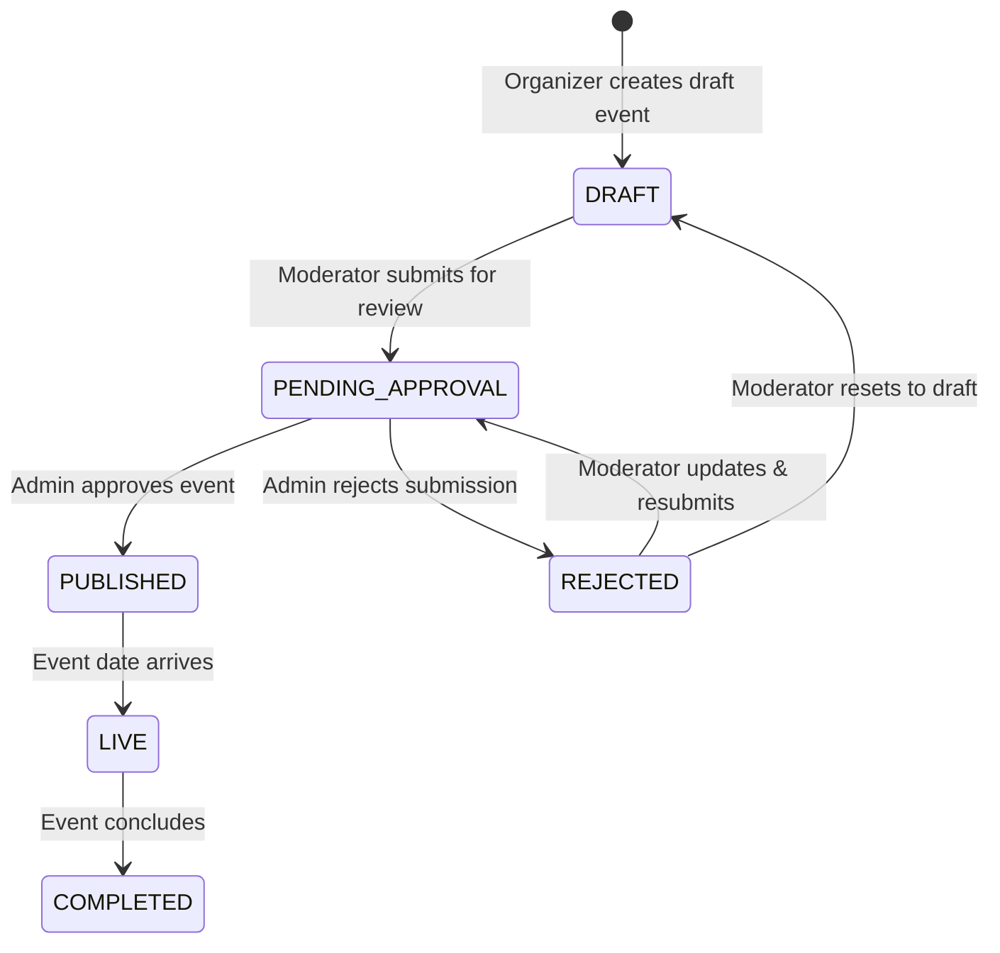
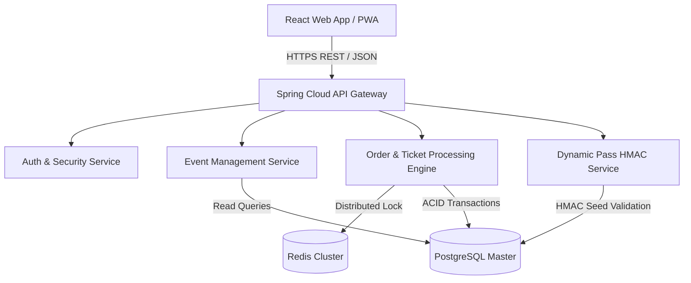

# SnapTix UML Diagrams

## 1. Domain Class Diagram

```mermaid
classDiagram
    class User {
        +UUID id
        +String email
        +String fullName
        +String role
        +String persona
        +LocalDateTime createdAt
        +register()
        +login()
    }

    class Event {
        +UUID id
        +String title
        +String description
        +String category
        +String city
        +String venue
        +String status
        +String createdByPersona
        +LocalDateTime date
        +createDraft()
        +submitForReview()
        +approveAndPublish()
        +reject()
    }

    class TicketTier {
        +UUID id
        +UUID eventId
        +String name
        +BigDecimal price
        +Integer capacity
        +Integer ticketsSold
        +reserveTicket()
    }

    class Order {
        +UUID id
        +UUID userId
        +BigDecimal totalAmount
        +String paymentStatus
        +String transactionRef
        +LocalDateTime createdAt
        +processPayment()
    }

    class TicketPass {
        +UUID id
        +UUID orderId
        +UUID tierId
        +UUID userId
        +String passStatus
        +String secretHMACKey
        +LocalDateTime issuedAt
        +generateRotatingToken(timestamp)
        +validateGateCheckIn(token)
    }

    class ResaleListing {
        +UUID id
        +UUID passId
        +UUID sellerId
        +UUID buyerId
        +BigDecimal listingPrice
        +BigDecimal originalFaceValue
        +String status
        +completeResaleTransfer()
    }

    User "1" -- "0..*" Event : creates
    Event "1" -- "1..*" TicketTier : contains
    User "1" -- "0..*" Order : places
    Order "1" -- "1..*" TicketPass : generates
    TicketTier "1" -- "0..*" TicketPass : categorizes
    TicketPass "1" -- "0..1" ResaleListing : listed_in
```

---

## 2. Event Approval Lifecycle State Machine

```mermaid
stateDiagram-v2
    [*] --> DRAFT : Organizer creates draft event
    DRAFT --> PENDING_APPROVAL : Moderator submits for review
    PENDING_APPROVAL --> PUBLISHED : Admin approves event
    PENDING_APPROVAL --> REJECTED : Admin rejects submission
    REJECTED --> PENDING_APPROVAL : Moderator updates & resubmits
    REJECTED --> DRAFT : Moderator resets to draft
    PUBLISHED --> LIVE : Event date arrives
    LIVE --> COMPLETED : Event concludes
```

---

## 3. System Component Architecture Diagram

```mermaid
graph TD
    Client[React Web App / PWA] -->|HTTPS REST / JSON| Gateway[Spring Cloud API Gateway]
    Gateway --> AuthSvc[Auth & Security Service]
    Gateway --> EventSvc[Event Management Service]
    Gateway --> OrderSvc[Order & Ticket Processing Engine]
    Gateway --> PassSvc[Dynamic Pass HMAC Service]

    OrderSvc -->|Distributed Lock| Redis[(Redis Cluster)]
    OrderSvc -->|ACID Transactions| DB[(PostgreSQL Master)]
    PassSvc -->|HMAC Seed Validation| DB
    EventSvc -->|Read Queries| DB
```
